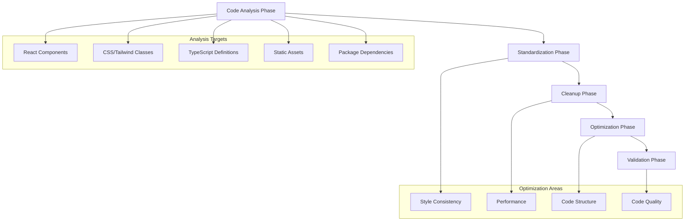

# Design Document: Frontend Code Optimization

## Overview

The Frontend Code Optimization project focuses on improving the existing Next.js 15.4.1 React application by standardizing CSS styling patterns, removing unnecessary code, and implementing modern best practices. The project will systematically analyze and optimize the codebase while maintaining functionality and improving maintainability.

The current frontend uses Next.js with App Router, TypeScript, Tailwind CSS 4, Radix UI components, and next-themes for theming. The optimization will focus on consistency, performance, and code quality improvements.

## Architecture

The optimization follows a systematic approach across different layers of the frontend architecture:



## Components and Interfaces

### 1. Code Analysis System

The optimization process begins with comprehensive code analysis to identify inconsistencies and optimization opportunities.

#### Analysis Categories

```typescript
interface AnalysisResult {
  styleInconsistencies: StyleInconsistency[];
  unusedCode: UnusedCodeItem[];
  performanceIssues: PerformanceIssue[];
  structureIssues: StructureIssue[];
  qualityIssues: QualityIssue[];
}

interface StyleInconsistency {
  file: string;
  line: number;
  issue: 'mixed-spacing' | 'inconsistent-breakpoints' | 'redundant-classes';
  current: string;
  recommended: string;
  impact: 'low' | 'medium' | 'high';
}

interface UnusedCodeItem {
  file: string;
  type: 'import' | 'variable' | 'function' | 'component' | 'prop';
  name: string;
  line: number;
}

interface PerformanceIssue {
  file: string;
  type: 'unnecessary-rerender' | 'large-bundle' | 'unoptimized-import';
  description: string;
  recommendation: string;
}
```

### 2. Style Standardization System

#### Spacing Convention Standards

Based on the analysis of existing components, the following standards will be applied:

```typescript
interface SpacingStandards {
  // Use gap for flex/grid layouts
  flexGap: 'gap-1' | 'gap-2' | 'gap-3' | 'gap-4' | 'gap-6' | 'gap-8';
  
  // Use padding for internal spacing
  padding: 'p-1' | 'p-2' | 'p-3' | 'p-4' | 'p-6' | 'p-8';
  
  // Use margin for external spacing (sparingly)
  margin: 'm-1' | 'm-2' | 'm-3' | 'm-4' | 'm-6' | 'm-8';
  
  // Consistent sizing patterns
  sizing: {
    icons: 'size-4' | 'size-5' | 'size-6' | 'size-8' | 'size-10';
    buttons: 'h-8' | 'h-9' | 'h-10' | 'h-12';
    inputs: 'h-9' | 'h-10' | 'h-12';
  };
}
```

#### Component Styling Patterns

```typescript
interface ComponentStylePatterns {
  // Button patterns (already well-defined in button.tsx)
  buttons: {
    variants: 'default' | 'destructive' | 'outline' | 'secondary' | 'ghost' | 'link';
    sizes: 'sm' | 'default' | 'lg' | 'xl' | 'icon';
    consistency: 'use-cva-patterns' | 'avoid-inline-styles';
  };
  
  // Layout patterns
  layouts: {
    containers: 'max-w-7xl mx-auto px-4' | 'container mx-auto';
    flexLayouts: 'flex items-center justify-between' | 'flex flex-col gap-4';
    gridLayouts: 'grid grid-cols-1 md:grid-cols-2 lg:grid-cols-3 gap-6';
  };
  
  // Interactive elements
  interactive: {
    hover: 'hover:bg-accent hover:text-accent-foreground';
    focus: 'focus-visible:ring-2 focus-visible:ring-ring';
    disabled: 'disabled:opacity-50 disabled:pointer-events-none';
  };
}
```

### 3. Component Structure Standards

#### Import Organization

```typescript
interface ImportStandards {
  order: [
    'react-imports',      // React, hooks
    'next-imports',       // Next.js specific
    'third-party',        // External libraries
    'ui-components',      // @/components/ui
    'local-components',   // @/components
    'utils-and-lib',      // @/lib, @/utils
    'types',              // Type imports
    'constants'           // @/constants
  ];
  
  grouping: {
    separateWithNewlines: true;
    sortAlphabetically: true;
    typeImportsLast: true;
  };
}
```

#### Component Structure Template

```typescript
interface ComponentStructure {
  // Standard component template
  template: {
    clientDirective?: '"use client"';
    imports: ImportStandards;
    types: TypeDefinitions;
    component: ComponentDefinition;
    export: ExportPattern;
  };
  
  // Props interface standards
  propsPattern: {
    interface: 'ComponentNameProps';
    destructuring: 'object-destructuring-preferred';
    defaultValues: 'use-default-parameters';
  };
  
  // Export patterns
  exportPattern: 'default-export-preferred' | 'named-export-for-utilities';
}
```

### 4. Performance Optimization Patterns

#### Bundle Optimization

```typescript
interface BundleOptimization {
  // Dynamic imports for large components
  dynamicImports: {
    heavyComponents: 'use-next-dynamic';
    conditionalComponents: 'lazy-load-when-needed';
    thirdPartyLibraries: 'dynamic-import-heavy-deps';
  };
  
  // Tree shaking optimization
  treeShaking: {
    imports: 'import-specific-functions';
    lodash: 'import-lodash-es-specific';
    icons: 'import-specific-icons-only';
  };
  
  // Code splitting
  codeSplitting: {
    routes: 'automatic-with-app-router';
    components: 'manual-for-heavy-components';
    utilities: 'shared-chunks-for-common-utils';
  };
}
```

#### Rendering Optimization

```typescript
interface RenderingOptimization {
  // React optimization patterns
  reactPatterns: {
    memoization: 'use-memo-for-expensive-calculations';
    callbacks: 'use-callback-for-stable-references';
    components: 'memo-for-pure-components';
  };
  
  // Next.js specific optimizations
  nextjsPatterns: {
    serverComponents: 'default-to-server-components';
    clientComponents: 'minimal-client-component-usage';
    streaming: 'use-suspense-boundaries';
  };
}
```

## Data Models

### 1. Optimization Configuration

```typescript
interface OptimizationConfig {
  // Style standardization rules
  styleRules: {
    spacingStrategy: 'gap-preferred' | 'space-preferred' | 'mixed-allowed';
    sizingUnits: 'tailwind-only' | 'css-custom-allowed';
    colorScheme: 'theme-variables-only' | 'hardcoded-allowed';
    responsiveBreakpoints: 'standard-tailwind' | 'custom-breakpoints';
  };
  
  // Code quality rules
  qualityRules: {
    importOrganization: ImportStandards;
    componentStructure: ComponentStructure;
    typeScriptStrict: boolean;
    accessibilityRequired: boolean;
  };
  
  // Performance thresholds
  performanceThresholds: {
    bundleSizeLimit: number; // in KB
    componentComplexity: number;
    renderTimeLimit: number; // in ms
    unusedCodeTolerance: number; // percentage
  };
}
```

### 2. File Processing Models

```typescript
interface FileProcessingPlan {
  file: string;
  category: 'component' | 'page' | 'layout' | 'utility' | 'type';
  priority: 'high' | 'medium' | 'low';
  optimizations: OptimizationType[];
  dependencies: string[];
  estimatedImpact: 'breaking' | 'non-breaking' | 'enhancement';
}

type OptimizationType = 
  | 'style-standardization'
  | 'unused-code-removal'
  | 'import-optimization'
  | 'component-restructure'
  | 'performance-enhancement'
  | 'accessibility-improvement';
```

## Error Handling

### 1. Optimization Safety

```typescript
interface OptimizationSafety {
  // Backup strategy
  backup: {
    createGitBranch: boolean;
    backupOriginalFiles: boolean;
    rollbackPlan: string;
  };
  
  // Validation steps
  validation: {
    typeScriptCompilation: boolean;
    eslintValidation: boolean;
    buildValidation: boolean;
    testSuiteExecution: boolean;
  };
  
  // Error recovery
  errorRecovery: {
    partialRollback: boolean;
    fileByFileValidation: boolean;
    dependencyImpactAnalysis: boolean;
  };
}
```

### 2. Breaking Change Detection

```typescript
interface BreakingChangeDetection {
  // API surface changes
  apiChanges: {
    componentProps: 'detect-prop-changes';
    exportedFunctions: 'detect-signature-changes';
    typeDefinitions: 'detect-type-changes';
  };
  
  // Runtime behavior changes
  behaviorChanges: {
    renderOutput: 'compare-render-trees';
    eventHandling: 'validate-event-flows';
    stateManagement: 'verify-state-consistency';
  };
}
```

## Testing Strategy

### 1. Pre-Optimization Testing

```typescript
interface PreOptimizationTesting {
  // Baseline establishment
  baseline: {
    bundleSize: 'measure-current-bundle-size';
    renderPerformance: 'benchmark-component-rendering';
    typeScriptErrors: 'capture-current-ts-errors';
    lintingIssues: 'capture-current-lint-issues';
  };
  
  // Functionality verification
  functionality: {
    componentRendering: 'snapshot-all-components';
    userInteractions: 'record-interaction-flows';
    themeToggling: 'verify-theme-consistency';
    responsiveDesign: 'test-breakpoint-behavior';
  };
}
```

### 2. Post-Optimization Validation

```typescript
interface PostOptimizationValidation {
  // Automated validation
  automated: {
    buildSuccess: 'verify-successful-build';
    typeScriptCompilation: 'ensure-no-new-ts-errors';
    lintingPassed: 'ensure-improved-lint-score';
    testSuitePassed: 'run-existing-test-suite';
  };
  
  // Performance validation
  performance: {
    bundleSizeReduction: 'measure-bundle-size-improvement';
    renderPerformance: 'benchmark-render-improvements';
    loadTimeImprovement: 'measure-page-load-times';
    memoryUsage: 'profile-memory-consumption';
  };
  
  // Visual regression testing
  visualRegression: {
    componentSnapshots: 'compare-component-renders';
    responsiveLayouts: 'verify-responsive-consistency';
    themeConsistency: 'validate-theme-application';
    accessibilityCompliance: 'run-a11y-audits';
  };
}
```

## Implementation Phases

### Phase 1: Analysis and Planning
- Comprehensive code analysis
- Inconsistency identification
- Optimization plan creation
- Risk assessment

### Phase 2: Style Standardization
- Implement consistent spacing patterns
- Standardize component styling
- Optimize Tailwind class usage
- Ensure responsive design consistency

### Phase 3: Code Cleanup
- Remove unused imports and variables
- Eliminate dead code
- Optimize component structure
- Clean up type definitions

### Phase 4: Performance Optimization
- Implement code splitting
- Optimize bundle size
- Enhance rendering performance
- Improve loading strategies

### Phase 5: Quality Assurance
- Comprehensive testing
- Performance benchmarking
- Accessibility validation
- Documentation updates

## Success Metrics

### Quantitative Metrics
- Bundle size reduction: Target 15-25% reduction
- Build time improvement: Target 10-20% faster builds
- Lint error reduction: Target 90%+ reduction in warnings
- TypeScript error elimination: Target 100% type safety

### Qualitative Metrics
- Code consistency: Standardized patterns across all components
- Maintainability: Improved developer experience
- Performance: Better user experience metrics
- Accessibility: WCAG 2.1 AA compliance

## Risk Mitigation

### Technical Risks
- **Breaking Changes**: Comprehensive testing and gradual rollout
- **Performance Regression**: Continuous benchmarking and monitoring
- **Type Safety Issues**: Strict TypeScript validation at each step

### Process Risks
- **Large Scope**: Phased approach with incremental validation
- **Team Coordination**: Clear communication and documentation
- **Rollback Complexity**: Git branching strategy and backup plans