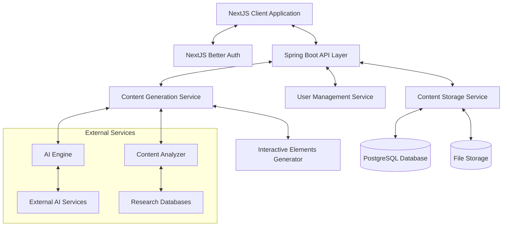
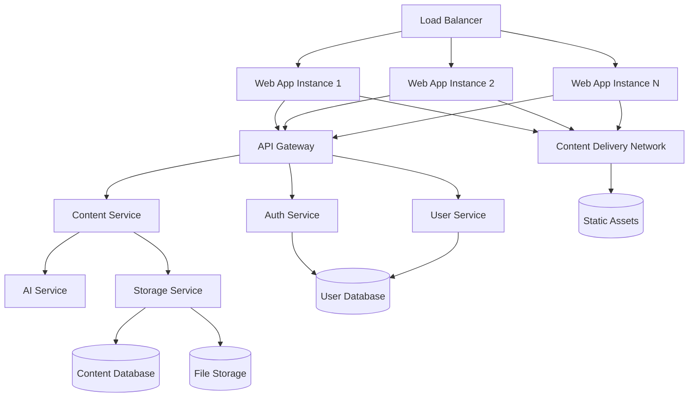

# Design Document: Interactive Learning Experience Generator

## Overview

The Interactive Learning Experience Generator is an AI-powered application that transforms educational content into engaging, interactive learning experiences. The system processes user inputs (topics or research papers) and generates personalized learning content with interactive elements such as quizzes, polls, and reordering exercises based on user preferences.

This design document outlines the architecture, components, data models, and other technical aspects of the application to fulfill the requirements specified in the requirements document.

## Architecture

The application follows a modern, scalable architecture with clear separation of concerns between the NextJS frontend with Better Auth and the Spring Boot API backend:



### Key Architectural Components:

1. **NextJS Client Application**: A responsive React/TypeScript web application providing the user interface.
2. **NextJS Better Auth**: Handles user authentication, registration, and session management within the NextJS application.
3. **Spring Boot API Layer**: RESTful API endpoints handling client requests and orchestrating backend services.
4. **Content Generation Service**: Core service responsible for generating learning content.
5. **User Management Service**: Handles user preference management and profile data (excluding authentication).
6. **Content Storage Service**: Manages persistence of generated content and user data in PostgreSQL.
7. **AI Engine**: Interfaces with AI models for content generation and enhancement.
8. **Interactive Elements Generator**: Creates interactive learning components.
9. **Content Analyzer**: Processes and analyzes input files and topics.

## SOLID-Based Domain Models

The application follows SOLID principles in its domain model design:

1. **Single Responsibility Principle**: Each model has a single responsibility
2. **Open/Closed Principle**: Models are open for extension but closed for modification
3. **Liskov Substitution Principle**: Subtypes can be substituted for their base types
4. **Interface Segregation Principle**: Clients depend only on interfaces they use
5. **Dependency Inversion Principle**: High-level modules depend on abstractions

### Base Models and Interfaces

```java
// Common enums
public enum ComplexityLevel {
    BEGINNER, INTERMEDIATE, ADVANCED
}

public enum KnowledgeLevel {
    NONE, BASIC, INTERMEDIATE, ADVANCED
}

// Base entity interface with common properties
public interface Entity {
    Long getId();
    LocalDateTime getCreatedAt();
    LocalDateTime getUpdatedAt();
}

// Base metadata class
@Embeddable
public class Metadata {
    private String tags;
    private ComplexityLevel complexity;
    private Integer estimatedDuration;

    // Getters and setters
}

// Base content element interface
public interface ContentElement extends Entity {
    String getType();
    Integer getOrder();
    Metadata getMetadata();
}

// Base container interface
public interface ContentContainer extends Entity {
    String getTitle();
    String getDescription();
    Metadata getMetadata();
}

// User progress tracking interface
public interface ProgressTrackable {
    Progress getUserProgress(Long userId);
    void updateUserProgress(Long userId, Progress progress);
}

// Learning preferences class
@Embeddable
public class LearningPreferences {
    @Enumerated(EnumType.STRING)
    private Duration duration;

    @Enumerated(EnumType.STRING)
    private Focus focus;

    @Enumerated(EnumType.STRING)
    private ComplexityLevel difficulty;

    @Enumerated(EnumType.STRING)
    private KnowledgeLevel priorKnowledge;

    // Getters and setters

    public enum Duration {
        SHORT, LONG
    }

    public enum Focus {
        DEPTH, BREADTH
    }

    public enum ContentFormat {
        COURSE, BLOCK
    }
}

// Progress class
@Embeddable
public class Progress {
    private boolean completed = false;
    private Integer score;
    private int attempts = 0;
    private LocalDateTime lastAttempt = LocalDateTime.now();

    // Getters and setters
}
```

### Widget System

```java
// Widget types enum
public enum WidgetType {
    TEXT, IMAGE, VIDEO, CODE, AUDIO, DIAGRAM, EMBED
}

// Widget interface
public interface Widget extends ContentElement {
    WidgetType getWidgetType();
    String render();
}

// Widget entity with JSON content
@Entity
@Table(name = "widgets")
@Data
public class Widget implements ContentElement, Entity {
    @Id
    @GeneratedValue(strategy = GenerationType.IDENTITY)
    private Long id;

    @Column(nullable = false)
    @Enumerated(EnumType.STRING)
    private WidgetType type;

    @Column(nullable = false)
    private Integer order;

    @Embedded
    private Metadata metadata;

    @CreationTimestamp
    private LocalDateTime createdAt;

    @UpdateTimestamp
    private LocalDateTime updatedAt;

    @ManyToOne(fetch = FetchType.LAZY)
    @JoinColumn(name = "block_id", nullable = false)
    private Block block;

    // JSON content column to store widget-specific data
    @Column(columnDefinition = "jsonb")
    private String content;

    public Widget() {}

    public Widget(WidgetType type, Integer order, String content) {
        this.type = type;
        this.order = order;
        this.content = content;
    }

    @Override
    public String getType() {
        return type.name();
    }

    public String render() {
        // Render based on widget type and content
        ObjectMapper mapper = new ObjectMapper();
        try {
            switch (type) {
                case TEXT:
                    TextContent textContent = mapper.readValue(content, TextContent.class);
                    return textContent.getContent();

                case IMAGE:
                    ImageContent imageContent = mapper.readValue(content, ImageContent.class);
                    return "";

                case VIDEO:
                    VideoContent videoContent = mapper.readValue(content, VideoContent.class);
                    if ("youtube".equalsIgnoreCase(videoContent.getEmbedType())) {
                        return "<iframe src='https://www.youtube.com/embed/" + videoContent.getEmbedId() +
                               "' frameborder='0' allowfullscreen></iframe>";
                    } else if ("vimeo".equalsIgnoreCase(videoContent.getEmbedType())) {
                        return "<iframe src='https://player.vimeo.com/video/" + videoContent.getEmbedId() +
                               "' frameborder='0' allowfullscreen></iframe>";
                    } else {
                        return "<video src='" + videoContent.getUrl() + "' controls></video>";
                    }

                default:
                    return "Unsupported widget type: " + type;
            }
        } catch (JsonProcessingException e) {
            return "Error rendering widget: " + e.getMessage();
        }
    }
}

// Content classes for different widget types
@Data
public static class TextContent {
    private String content;
    private String formatting;
}

@Data
public static class ImageContent {
    private String url;
    private String altText;
    private String caption;
}

@Data
public static class VideoContent {
    private String url;
    private String embedType;
    private String embedId;
}

// Widget factory for creating widgets with appropriate content
@Component
public class WidgetFactory {
    private final ObjectMapper objectMapper = new ObjectMapper();

    public Widget createWidget(WidgetType type, Object contentData, Integer order, Metadata metadata) {
        try {
            String jsonContent = objectMapper.writeValueAsString(contentData);
            Widget widget = new Widget(type, order, jsonContent);
            widget.setMetadata(metadata);
            return widget;
        } catch (JsonProcessingException e) {
            throw new IllegalArgumentException("Failed to serialize widget content", e);
        }
    }

    public Widget createTextWidget(String content, String formatting, Integer order, Metadata metadata) {
        TextContent textContent = new TextContent();
        textContent.setContent(content);
        textContent.setFormatting(formatting);
        return createWidget(WidgetType.TEXT, textContent, order, metadata);
    }

    public Widget createImageWidget(String url, String altText, String caption, Integer order, Metadata metadata) {
        ImageContent imageContent = new ImageContent();
        imageContent.setUrl(url);
        imageContent.setAltText(altText);
        imageContent.setCaption(caption);
        return createWidget(WidgetType.IMAGE, imageContent, order, metadata);
    }

    public Widget createVideoWidget(String url, String embedType, String embedId, Integer order, Metadata metadata) {
        VideoContent videoContent = new VideoContent();
        videoContent.setUrl(url);
        videoContent.setEmbedType(embedType);
        videoContent.setEmbedId(embedId);
        return createWidget(WidgetType.VIDEO, videoContent, order, metadata);
    }
}
```

### Interactive Elements System

```java
// Interactive element types enum
public enum InteractiveElementType {
    QUIZ, POLL, REORDER, MATCHING, FLASHCARD, FILL_BLANK, CODE_EXERCISE
}

// Evaluation result class
@Embeddable
public class EvaluationResult {
    private boolean correct;
    private int score;
    private String feedback;
    private List<String> hints = new ArrayList<>();

    // Getters and setters
}

// Interactive element interface
public interface InteractiveElement extends ContentElement, ProgressTrackable {
    InteractiveElementType getElementType();
    String getTitle();
    EvaluationResult evaluate(String response);
    String render();
}

// Interactive element entity with JSON content
@Entity
@Table(name = "interactive_elements")
@Data
public class InteractiveElement implements ContentElement, ProgressTrackable, Entity {
    @Id
    @GeneratedValue(strategy = GenerationType.IDENTITY)
    private Long id;

    @Column(nullable = false)
    @Enumerated(EnumType.STRING)
    private InteractiveElementType type;

    @Column(nullable = false)
    private Integer order;

    @Column(nullable = false)
    private String title;

    @Embedded
    private Metadata metadata;

    @CreationTimestamp
    private LocalDateTime createdAt;

    @UpdateTimestamp
    private LocalDateTime updatedAt;

    @ManyToOne(fetch = FetchType.LAZY)
    @JoinColumn(name = "block_id", nullable = false)
    private Block block;

    // JSON content column to store element-specific data including instructions
    @Column(columnDefinition = "jsonb")
    private String content;

    @ElementCollection
    @CollectionTable(name = "user_progress",
        joinColumns = @JoinColumn(name = "element_id"))
    @MapKeyJoinColumn(name = "user_id")
    private Map<User, Progress> userProgress = new HashMap<>();

    public InteractiveElement() {}

    public InteractiveElement(InteractiveElementType type, Integer order, String title, String content) {
        this.type = type;
        this.order = order;
        this.title = title;
        this.content = content;
    }

    @Override
    public String getType() {
        return type.name();
    }

    public EvaluationResult evaluate(String response) {
        // Evaluate based on element type and content
        ObjectMapper mapper = new ObjectMapper();
        try {
            switch (type) {
                case QUIZ:
                    QuizContent quizContent = mapper.readValue(content, QuizContent.class);
                    return evaluateQuiz(quizContent, response);

                case POLL:
                    // Poll doesn't have right/wrong answers
                    EvaluationResult pollResult = new EvaluationResult();
                    pollResult.setCorrect(true);
                    pollResult.setFeedback("Thank you for your response!");
                    return pollResult;

                case REORDER:
                    ReorderContent reorderContent = mapper.readValue(content, ReorderContent.class);
                    return evaluateReorder(reorderContent, response);

                default:
                    EvaluationResult defaultResult = new EvaluationResult();
                    defaultResult.setCorrect(false);
                    defaultResult.setFeedback("Evaluation not implemented for this element type.");
                    return defaultResult;
            }
        } catch (JsonProcessingException e) {
            EvaluationResult errorResult = new EvaluationResult();
            errorResult.setCorrect(false);
            errorResult.setFeedback("Error evaluating response: " + e.getMessage());
            return errorResult;
        }
    }

    private EvaluationResult evaluateQuiz(QuizContent quizContent, String response) {
        // Simple implementation
        EvaluationResult result = new EvaluationResult();
        result.setCorrect(true);
        result.setScore(100);
        result.setFeedback("Great job!");
        return result;
    }

    private EvaluationResult evaluateReorder(ReorderContent reorderContent, String response) {
        // Simple implementation
        EvaluationResult result = new EvaluationResult();
        result.setCorrect(true);
        result.setScore(100);
        result.setFeedback("Perfect order!");
        return result;
    }

    public String render() {
        // Render based on element type and content
        ObjectMapper mapper = new ObjectMapper();
        try {
            switch (type) {
                case QUIZ:
                    QuizContent quizContent = mapper.readValue(content, QuizContent.class);
                    return renderQuiz(quizContent);

                case POLL:
                    PollContent pollContent = mapper.readValue(content, PollContent.class);
                    return renderPoll(pollContent);

                case REORDER:
                    ReorderContent reorderContent = mapper.readValue(content, ReorderContent.class);
                    return renderReorder(reorderContent);

                default:
                    return "Unsupported interactive element type: " + type;
            }
        } catch (JsonProcessingException e) {
            return "Error rendering interactive element: " + e.getMessage();
        }
    }

    private String renderQuiz(QuizContent quizContent) {
        StringBuilder sb = new StringBuilder();
        sb.append("<div class='quiz'><h3>").append(title).append("</h3>");

        if (quizContent.getInstructions() != null) {
            sb.append("<p>").append(quizContent.getInstructions()).append("</p>");
        }

        sb.append("<form>");
        for (QuizContent.Question question : quizContent.getQuestions()) {
            sb.append("<div class='question'>");
            sb.append("<p>").append(question.getText()).append("</p>");

            // Render options based on question type
            if (question.getOptions() != null) {
                for (QuizContent.Option option : question.getOptions()) {
                    sb.append("<label><input type='radio' name='q").append(question.getId())
                      .append("' value='").append(option.getId()).append("'> ")
                      .append(option.getText()).append("</label><br>");
                }
            }

            sb.append("</div>");
        }

        sb.append("<button type='submit'>Submit</button></form></div>");
        return sb.toString();
    }

    private String renderPoll(PollContent pollContent) {
        StringBuilder sb = new StringBuilder();
        sb.append("<div class='poll'><h3>").append(title).append("</h3>");

        if (pollContent.getInstructions() != null) {
            sb.append("<p>").append(pollContent.getInstructions()).append("</p>");
        }

        sb.append("<form>");
        sb.append("<p>").append(pollContent.getQuestion()).append("</p>");

        String inputType = pollContent.isAllowMultipleSelections() ? "checkbox" : "radio";
        for (PollContent.Option option : pollContent.getOptions()) {
            sb.append("<label><input type='").append(inputType).append("' name='poll")
              .append("' value='").append(option.getId()).append("'> ")
              .append(option.getText()).append("</label><br>");
        }

        sb.append("<button type='submit'>Submit</button></form></div>");
        return sb.toString();
    }

    private String renderReorder(ReorderContent reorderContent) {
        StringBuilder sb = new StringBuilder();
        sb.append("<div class='reorder'><h3>").append(title).append("</h3>");

        if (reorderContent.getInstructions() != null) {
            sb.append("<p>").append(reorderContent.getInstructions()).append("</p>");
        }

        sb.append("<ul class='sortable'>");
        for (ReorderContent.Item item : reorderContent.getItems()) {
            sb.append("<li data-id='").append(item.getId()).append("'>")
              .append(item.getText()).append("</li>");
        }
        sb.append("</ul>");

        sb.append("<button type='button'>Check Order</button></div>");
        return sb.toString();
    }

    @Override
    public Progress getUserProgress(Long userId) {
        // In a real implementation, we would look up the User entity
        User user = new User();
        user.setId(userId);
        return userProgress.getOrDefault(user, new Progress());
    }

    @Override
    public void updateUserProgress(Long userId, Progress progress) {
        // In a real implementation, we would look up the User entity
        User user = new User();
        user.setId(userId);
        userProgress.put(user, progress);
    }
}

// Content classes for different interactive element types
@Data
public static class QuizContent {
    private String instructions;
    private List<Question> questions = new ArrayList<>();

    @Data
    public static class Question {
        private String id;
        private String text;
        private String type; // MULTIPLE_CHOICE, TRUE_FALSE, SHORT_ANSWER
        private String correctAnswer;
        private String explanation;
        private List<Option> options = new ArrayList<>();
    }

    @Data
    public static class Option {
        private String id;
        private String text;
    }
}

@Data
public static class PollContent {
    private String instructions;
    private String question;
    private boolean allowMultipleSelections;
    private boolean showResults;
    private List<Option> options = new ArrayList<>();

    @Data
    public static class Option {
        private String id;
        private String text;
    }
}

@Data
public static class ReorderContent {
    private String instructions;
    private List<Item> items = new ArrayList<>();

    @Data
    public static class Item {
        private String id;
        private String text;
        private int correctPosition;
    }
}

// Interactive element factory for creating elements with appropriate content
@Component
public class InteractiveElementFactory {
    private final ObjectMapper objectMapper = new ObjectMapper();

    public InteractiveElement createInteractiveElement(InteractiveElementType type, Object contentData,
                                                      Integer order, String title,
                                                      Metadata metadata) {
        try {
            String jsonContent = objectMapper.writeValueAsString(contentData);
            InteractiveElement element = new InteractiveElement(type, order, title, jsonContent);
            element.setMetadata(metadata);
            return element;
        } catch (JsonProcessingException e) {
            throw new IllegalArgumentException("Failed to serialize interactive element content", e);
        }
    }

    public InteractiveElement createQuizElement(List<QuizContent.Question> questions,
                                               String instructions,
                                               Integer order, String title,
                                               Metadata metadata) {
        QuizContent quizContent = new QuizContent();
        quizContent.setQuestions(questions);
        quizContent.setInstructions(instructions);
        return createInteractiveElement(InteractiveElementType.QUIZ, quizContent,
                                       order, title, metadata);
    }

    public InteractiveElement createPollElement(String question, List<PollContent.Option> options,
                                              boolean allowMultipleSelections, boolean showResults,
                                              String instructions,
                                              Integer order, String title,
                                              Metadata metadata) {
        PollContent pollContent = new PollContent();
        pollContent.setQuestion(question);
        pollContent.setOptions(options);
        pollContent.setAllowMultipleSelections(allowMultipleSelections);
        pollContent.setShowResults(showResults);
        pollContent.setInstructions(instructions);
        return createInteractiveElement(InteractiveElementType.POLL, pollContent,
                                       order, title, metadata);
    }

    public InteractiveElement createReorderElement(List<ReorderContent.Item> items,
                                                 String instructions,
                                                 Integer order, String title,
                                                 Metadata metadata) {
        ReorderContent reorderContent = new ReorderContent();
        reorderContent.setItems(items);
        reorderContent.setInstructions(instructions);
        return createInteractiveElement(InteractiveElementType.REORDER, reorderContent,
                                       order, title, metadata);
    }
}
```

### Content Organization Models

```java
// Block entity
@Entity
@Table(name = "blocks")
@Data
public class Block implements ContentContainer, Entity {
    @Id
    @GeneratedValue(strategy = GenerationType.IDENTITY)
    private Long id;

    @Column(nullable = false)
    private String title;

    @Column(length = 1000)
    private String description;

    @ManyToOne(fetch = FetchType.LAZY)
    @JoinColumn(name = "content_id")
    private GeneratedContent generatedContent;

    @ManyToOne(fetch = FetchType.LAZY)
    @JoinColumn(name = "module_id")
    private Module module;

    @Embedded
    private Metadata metadata;

    @CreationTimestamp
    private LocalDateTime createdAt;

    @UpdateTimestamp
    private LocalDateTime updatedAt;

    @OneToMany(mappedBy = "block", cascade = CascadeType.ALL, orphanRemoval = true)
    @OrderBy("order ASC")
    private List<Widget> widgets = new ArrayList<>();

    @OneToMany(mappedBy = "block", cascade = CascadeType.ALL, orphanRemoval = true)
    @OrderBy("order ASC")
    private List<InteractiveElement> interactiveElements = new ArrayList<>();

    // Methods to get all content elements in order
    public List<ContentElement> getContentElements() {
        List<ContentElement> elements = new ArrayList<>();
        elements.addAll(widgets);
        elements.addAll(interactiveElements);
        elements.sort(Comparator.comparing(ContentElement::getOrder));
        return elements;
    }
}

// Module entity
@Entity
@Table(name = "modules")
@Data
public class Module implements ContentContainer, Entity {
    @Id
    @GeneratedValue(strategy = GenerationType.IDENTITY)
    private Long id;

    @Column(nullable = false)
    private String title;

    @Column(length = 1000)
    private String description;

    @ManyToOne(fetch = FetchType.LAZY)
    @JoinColumn(name = "content_id", nullable = false)
    private GeneratedContent generatedContent;

    @Column(length = 1000)
    private String learningObjectives;

    @Embedded
    private Metadata metadata;

    @CreationTimestamp
    private LocalDateTime createdAt;

    @UpdateTimestamp
    private LocalDateTime updatedAt;

    @OneToMany(mappedBy = "module", cascade = CascadeType.ALL, orphanRemoval = true)
    @OrderBy("id ASC")
    private List<Block> blocks = new ArrayList<>();
}
```

### Content Generation Models

```java
// Input source class
@Embeddable
@Data
public class InputSource {
    @Enumerated(EnumType.STRING)
    private InputType type;

    @Column(length = 1000)
    private String value;

    public enum InputType {
        TOPIC, FILE
    }
}

// Generated content entity
@Entity
@Table(name = "generated_contents")
@Data
public class GeneratedContent implements Entity {
    @Id
    @GeneratedValue(strategy = GenerationType.IDENTITY)
    private Long id;

    @Column(nullable = false)
    private String title;

    @Column(length = 1000)
    private String description;

    @Enumerated(EnumType.STRING)
    private LearningPreferences.ContentFormat format;

    @Embedded
    private InputSource inputSource;

    @Embedded
    private LearningPreferences preferences;

    @ManyToOne(fetch = FetchType.LAZY)
    @JoinColumn(name = "user_id")
    private User user;

    @CreationTimestamp
    private LocalDateTime createdAt;

    @UpdateTimestamp
    private LocalDateTime updatedAt;

    @OneToMany(mappedBy = "generatedContent", cascade = CascadeType.ALL, orphanRemoval = true)
    private List<Block> blocks = new ArrayList<>();

    @OneToMany(mappedBy = "generatedContent", cascade = CascadeType.ALL, orphanRemoval = true)
    private List<Module> modules = new ArrayList<>();

    @OneToMany(mappedBy = "generatedContent", cascade = CascadeType.ALL, orphanRemoval = true)
    private Set<ContentFeedback> feedbacks = new HashSet<>();

    @Embedded
    private SharingInfo sharingInfo = new SharingInfo();

    @Embeddable
    @Data
    public static class SharingInfo {
        private boolean isShared = false;
        private String shareLink;
        private LocalDateTime sharedAt;
    }

    public boolean isCourse() {
        return format == LearningPreferences.ContentFormat.COURSE;
    }

    public String share() {
        sharingInfo.setShared(true);
        sharingInfo.setSharedAt(LocalDateTime.now());
        sharingInfo.setShareLink("share/" + id);
        return sharingInfo.getShareLink();
    }

    public void unshare() {
        sharingInfo.setShared(false);
    }

    public boolean isShared() {
        return sharingInfo.isShared();
    }

    public void addFeedback(ContentFeedback feedback) {
        feedbacks.add(feedback);
        feedback.setGeneratedContent(this);
    }
}

// Content feedback entity
@Entity
@Table(name = "content_feedbacks")
@Data
public class ContentFeedback implements Entity {
    @Id
    @GeneratedValue(strategy = GenerationType.IDENTITY)
    private Long id;

    @ManyToOne(fetch = FetchType.LAZY)
    @JoinColumn(name = "content_id", nullable = false)
    private GeneratedContent generatedContent;

    @ManyToOne(fetch = FetchType.LAZY)
    @JoinColumn(name = "user_id")
    private User user;

    private Integer rating;

    @Column(length = 1000)
    private String comments;

    @Column(length = 1000)
    private String reportedIssue;

    @CreationTimestamp
    private LocalDateTime createdAt;

    @UpdateTimestamp
    private LocalDateTime updatedAt;
}
```

### Repository Interfaces

```java
// Content element repository
@Repository
public interface ContentElementRepository extends JpaRepository<ContentElement, Long> {
    List<ContentElement> findByBlockOrderByOrderAsc(Block block);
}

// Widget repository
@Repository
public interface WidgetRepository extends JpaRepository<Widget, Long> {
    List<Widget> findByBlockOrderByOrderAsc(Block block);
}

// Interactive element repository
@Repository
public interface InteractiveElementRepository extends JpaRepository<InteractiveElement, Long> {
    List<InteractiveElement> findByBlockOrderByOrderAsc(Block block);
}

// Block repository
@Repository
public interface BlockRepository extends JpaRepository<Block, Long> {
    List<Block> findByGeneratedContent(GeneratedContent generatedContent);
    List<Block> findByModule(Module module);
}

// Module repository
@Repository
public interface ModuleRepository extends JpaRepository<Module, Long> {
    List<Module> findByGeneratedContent(GeneratedContent generatedContent);
}

// Generated content repository
@Repository
public interface GeneratedContentRepository extends JpaRepository<GeneratedContent, Long> {
    List<GeneratedContent> findByUser(User user);
    List<GeneratedContent> findByUserOrderByCreatedAtDesc(User user);
    Optional<GeneratedContent> findBySharingInfoShareLink(String shareLink);
}

// User repository
@Repository
public interface UserRepository extends JpaRepository<User, Long> {
    Optional<User> findByEmail(String email);
    boolean existsByEmail(String email);
}
```

### Service Interfaces

```java
// Content generation service
public interface ContentGenerationService {
    GeneratedContent generateFromTopic(String topic, LearningPreferences preferences, User user);
    GeneratedContent generateFromFile(MultipartFile file, LearningPreferences preferences, User user);
}

// Content generation service implementation
@Service
@RequiredArgsConstructor
public class ContentGenerationServiceImpl implements ContentGenerationService {
    private final AIService aiService;
    private final GeneratedContentRepository contentRepository;
    private final BlockRepository blockRepository;
    private final ModuleRepository moduleRepository;
    private final WidgetFactory widgetFactory;
    private final InteractiveElementFactory elementFactory;

    @Override
    public GeneratedContent generateFromTopic(String topic, LearningPreferences preferences, User user) {
        // Create a new generated content
        GeneratedContent content = new GeneratedContent();
        content.setTitle("Learning " + topic);
        content.setDescription("A generated course about " + topic);
        content.setFormat(preferences.getDuration() == LearningPreferences.Duration.LONG ?
                         LearningPreferences.ContentFormat.COURSE :
                         LearningPreferences.ContentFormat.BLOCK);

        // Set input source
        InputSource inputSource = new InputSource();
        inputSource.setType(InputSource.InputType.TOPIC);
        inputSource.setValue(topic);
        content.setInputSource(inputSource);

        // Set preferences and user
        content.setPreferences(preferences);
        content.setUser(user);

        // Save the content
        contentRepository.save(content);

        // Generate content based on preferences
        if (content.isCourse()) {
            generateCourseContent(content, topic);
        } else {
            generateBlockContent(content, topic);
        }

        return content;
    }

    @Override
    public GeneratedContent generateFromFile(MultipartFile file, LearningPreferences preferences, User user) {
        // Implementation details omitted for brevity
        // Similar to generateFromTopic but processes file content
        return null;
    }

    private void generateCourseContent(GeneratedContent content, String topic) {
        // Implementation details omitted for brevity
        // Would use AI service to generate course structure and content
    }

    private void generateBlockContent(GeneratedContent content, String topic) {
        // Implementation details omitted for brevity
        // Would use AI service to generate block content
    }
}
```

This modular, extensible design follows SOLID principles:

1. **Single Responsibility**: Each class has a single purpose (e.g., Widget handles rendering, Block manages content elements)
2. **Open/Closed**: New widget types or interactive elements can be added without modifying existing code
3. **Liskov Substitution**: Any Widget can be used where a widget is expected
4. **Interface Segregation**: Interfaces are focused and specific (e.g., ProgressTrackable for elements that track progress)
5. **Dependency Inversion**: High-level modules depend on abstractions (e.g., repositories, factories)

## Database Class Diagram

```mermaid
classDiagram
    class User {
        +Long id
        +String email
        +String name
        +LocalDateTime createdAt
        +LocalDateTime updatedAt
        +LocalDateTime lastLogin
        +List~UserPreferences~ preferences
        +List~GeneratedContent~ contents
    }

    class UserPreferences {
        +User user
        +Duration defaultDuration
        +Focus defaultFocus
        +ComplexityLevel defaultDifficulty
        +String accessibilitySettings
    }

    class GeneratedContent {
        +Long id
        +String title
        +String description
        +ContentFormat format
        +InputSource inputSource
        +LearningPreferences preferences
        +User user
        +LocalDateTime createdAt
        +LocalDateTime updatedAt
        +List~Block~ blocks
        +List~Module~ modules
        +Set~ContentFeedback~ feedbacks
        +SharingInfo sharingInfo
        +boolean isCourse()
        +String share()
        +void unshare()
        +boolean isShared()
    }

    class InputSource {
        +InputType type
        +String value
    }

    class LearningPreferences {
        +Duration duration
        +Focus focus
        +ComplexityLevel difficulty
        +KnowledgeLevel priorKnowledge
    }

    class SharingInfo {
        +boolean isShared
        +String shareLink
        +LocalDateTime sharedAt
    }

    class Module {
        +Long id
        +String title
        +String description
        +String learningObjectives
        +GeneratedContent generatedContent
        +Metadata metadata
        +LocalDateTime createdAt
        +LocalDateTime updatedAt
        +List~Block~ blocks
    }

    class Block {
        +Long id
        +String title
        +String description
        +GeneratedContent generatedContent
        +Module module
        +Metadata metadata
        +LocalDateTime createdAt
        +LocalDateTime updatedAt
        +List~Widget~ widgets
        +List~InteractiveElement~ interactiveElements
        +List~ContentElement~ getContentElements()
    }

    class Widget {
        +Long id
        +WidgetType type
        +Integer order
        +Block block
        +Metadata metadata
        +String content
        +LocalDateTime createdAt
        +LocalDateTime updatedAt
        +String render()
    }

    class InteractiveElement {
        +Long id
        +InteractiveElementType type
        +Integer order
        +String title
        +Block block
        +Metadata metadata
        +String content
        +Map~User, Progress~ userProgress
        +LocalDateTime createdAt
        +LocalDateTime updatedAt
        +EvaluationResult evaluate(String)
        +String render()
        +Progress getUserProgress(Long)
        +void updateUserProgress(Long, Progress)
    }

    class ContentFeedback {
        +Long id
        +GeneratedContent generatedContent
        +User user
        +Integer rating
        +String comments
        +String reportedIssue
        +LocalDateTime createdAt
        +LocalDateTime updatedAt
    }

    class Metadata {
        +String tags
        +ComplexityLevel complexity
        +Integer estimatedDuration
    }

    class Progress {
        +boolean completed
        +Integer score
        +int attempts
        +LocalDateTime lastAttempt
    }

    User "1" -- "0..*" UserPreferences : has
    User "1" -- "0..*" GeneratedContent : creates
    User "1" -- "0..*" ContentFeedback : provides

    GeneratedContent "1" -- "1" InputSource : has
    GeneratedContent "1" -- "1" LearningPreferences : has
    GeneratedContent "1" -- "1" SharingInfo : has
    GeneratedContent "1" -- "0..*" Module : contains
    GeneratedContent "1" -- "0..*" Block : contains
    GeneratedContent "1" -- "0..*" ContentFeedback : receives

    Module "1" -- "0..*" Block : contains
    Module "1" -- "1" Metadata : has

    Block "1" -- "0..*" Widget : contains
    Block "1" -- "0..*" InteractiveElement : contains
    Block "1" -- "1" Metadata : has

    InteractiveElement "1" -- "0..*" Progress : tracks
````

## Error Handling

The application implements a comprehensive error handling strategy:

### Error Categories:

1. **Validation Errors**: Issues with user input
2. **Authentication Errors**: Issues with user authentication
3. **Processing Errors**: Issues during content generation
4. **Storage Errors**: Issues with data persistence
5. **External Service Errors**: Issues with third-party services

### Error Response Format:

```java
@Data
public class ErrorResponse {
    private ErrorDetails error;

    @Data
    public static class ErrorDetails {
        private String code;
        private String message;
        private Map<String, Object> details;
        private LocalDateTime timestamp;
        private String requestId;
    }
}
```

### Error Handling Strategy:

1. **Client-Side Validation**: Prevent invalid requests before submission
2. **API Input Validation**: Validate all incoming requests using Spring Validation
3. **Graceful Degradation**: Provide alternative functionality when services fail
4. **Comprehensive Logging**: Log errors with context for debugging
5. **User-Friendly Messages**: Display helpful error messages to users
6. **Retry Mechanisms**: Implement automatic retries for transient failures

## Testing Strategy

The application employs a comprehensive testing strategy:

### Testing Levels:

1. **Unit Testing**: Test individual components in isolation

   - Service methods
   - Utility functions
   - Model validations

2. **Integration Testing**: Test interactions between components

   - API endpoints
   - Service interactions
   - Database operations

3. **End-to-End Testing**: Test complete user flows

   - Content generation workflow
   - User authentication flow
   - Content sharing flow

4. **Performance Testing**: Test system performance under load

   - Content generation response time
   - Concurrent user handling
   - Resource utilization

5. **Accessibility Testing**: Ensure WCAG compliance
   - Screen reader compatibility
   - Keyboard navigation
   - Color contrast

### Testing Tools and Frameworks:

- Unit Testing: JUnit, Mockito
- Integration Testing: Spring Test, Testcontainers
- End-to-End Testing: Selenium, Cypress
- Performance Testing: JMeter, Gatling
- Accessibility Testing: Axe, Lighthouse

### Testing Approach:

- Test-Driven Development (TDD) for core functionality
- Continuous Integration with automated test runs
- Regular accessibility audits
- User acceptance testing with representative users

## Security Considerations

The application implements several security measures:

1. **Authentication**: Secure user authentication with Spring Security and JWT tokens
2. **Authorization**: Role-based access control for protected resources
3. **Data Protection**: Encryption for sensitive data at rest and in transit
4. **Input Validation**: Thorough validation of all user inputs
5. **Rate Limiting**: Protection against abuse and DoS attacks
6. **Content Security**: Validation of generated content for harmful material
7. **Dependency Security**: Regular scanning and updating of dependencies
8. **Audit Logging**: Comprehensive logging of security-relevant events

## Deployment Architecture

The application is designed for cloud deployment with the following architecture:



Key deployment components:

- Containerized microservices with Docker and Kubernetes
- Auto-scaling based on demand
- PostgreSQL database with connection pooling
- Content delivery network for static assets
- Monitoring and alerting system with Prometheus and Grafana
- Automated backup and disaster recovery
